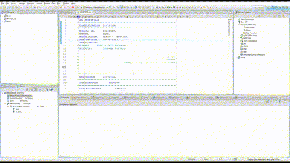

# Feedback
A Developer for z (IDz, formerly RDZ) plugin for making COBOL compiler messages easily accessible.

[](demo/feedback.webm?raw=true)  
[Click for HD video](demo/feedback.webm?raw=true)  
[Demo breakdown](demo/README.md)

This is a *working* technical demo, not a finalized product.  
Comments are welcome.

## Features
* Compile your code with the press of a button (F9)
* Monitor the compilation job as it runs
* Display compilation messages in the editor

## Usage notes
* Only the **COBOL editor** is support at this time - The features are only available from within the COBOL editor.
  * A `Feedback` context menu is available when right-clicking inside the editor    
* Source code must reside in **PDS / PDSE** datasets 
  * Member names are required to differentiate between compilation jobs; identical names will use the same job
* Compilation jobs may be as complex as you want
  * FEEDBACK XML results can be concatenated

# Getting started
## Building
### Prerequisites
1. Set up a [target platform](https://github.com/uricorin/feedback/wiki/Setting-up-a-target-platform)

### Native build
1. Update the reference to the target platform in ./maven/cloud.corin.feedback/releng/cloud.corin.feedback.configuration/pom.xml
2. Change directory to maven/cloud.corin.feedback
3. Run the following command `mvn clean verify` (requires maven)

### Dockerized build
1. Optional - Update the reference eclipse-repo.url to the target platform in maven/cloud.corin.feedback/releng/cloud.corin.feedback.configuration/pom.xml  
    1. For IBM's aqua3.2, no change is required
    2. For IBM's aqua3.1, use the commented-out line

2. Run the following command (requires docker)  
    ``` 
    docker run --rm -it -w /project -v <path to maven/cloud.corin.feedback directory>:/project -v <path to update site zip file>:/update-sites/aqua-update-site.zip maven:3.8.5-openjdk-8 mvn clean verify
    ```  
    For exmaple:  
      1. Change directory to the base directory of the project  
      2. Place the update site zip (aqua3.2_all_update_site.zip) in the base directory  
      3. Run
          ``` 
          docker run --rm -it -w /project -v maven/cloud.corin.feedback:/project -v aqua3 2_all_update_site.zip:/update-sites/aqua-update-site.zip maven:3.8.5-openjdk-8 mvn clean verify 
          ```
        
### Artifacts
Installable artifacts will be created in maven/cloud.corin.feedback/releng/cloud.corin.feedback.update/target/

## Installing
1. Inside IDz, add the p2 update site produced in the previous step (or downloaded from [Releases](https://github.com/uricorin/feedback/releases)) to Available Software Sites
2. Under Install New Software, navigate to the new site and install the plugin 

## Tailoring a compilation job
* The COBOL compilation step must invoke IDz's feedback exit
  * Add `ADATA,EXIT(ADEXIT(ELAXMGUX))` as compilation options
  * Add ID'z `SFELLOAD` dataset to STEPLIB (or LINKLIST, LPA, ...)
* The exit will output compiler messages to a special DD in XML format
  * ADD DD `SYSXMLSD` to the compilation step, allocated as detailed in 
https://www.ibm.com/support/knowledgecenter/SSQ2R2_14.2.0/com.ibm.ent.pl1.zos.doc/pg/ibma1d41004453.html

## Datasets
The following datasets are utilized:
* `<user>.LIB.FEEDBACK.CNTL` - PDS containing compilation jobs
  * The plugin submits compilation jobs from here
* `<user>.FEEDBACK.<member name>.XML` - Compiler messages in XML format
  * The plugin consumes this dataset to populate the Remote Error List view 
* `<user>.AUDITOR.<member name>.XML` - Optional, static analysis messages produced by CC AUDITOR, a 3rd-party tool
  * The plugin consumes this dataset to populate the Remote Error List view 

# Docs
## Javadoc
https://uricorin.github.io/feedback/

## Eclipse plugins
https://www.vogella.com/tutorials/eclipseplatform.html


# License
This project is mostly licensed under the [MIT](LICENSE) license.  
The following class is the exception:
* [LineReader](maven/cloud.corin.feedback/bundles/cloud.corin.feedback.core/src/cloud/corin/common/rdz/LineReader.java)  
  * @Author Torleif Berger
  * @license http://creativecommons.org/licenses/by/3.0/
  * @see http://www.geekality.net/?p=1614
