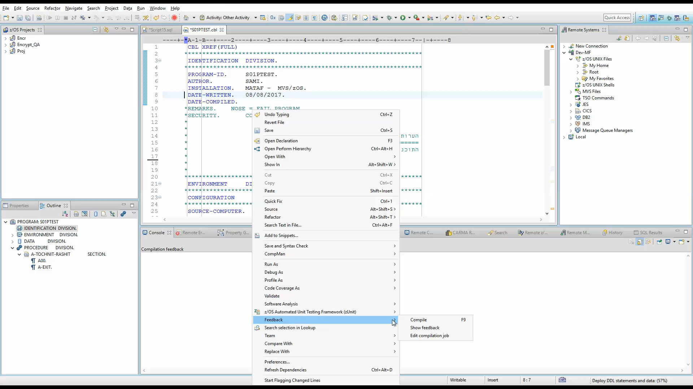
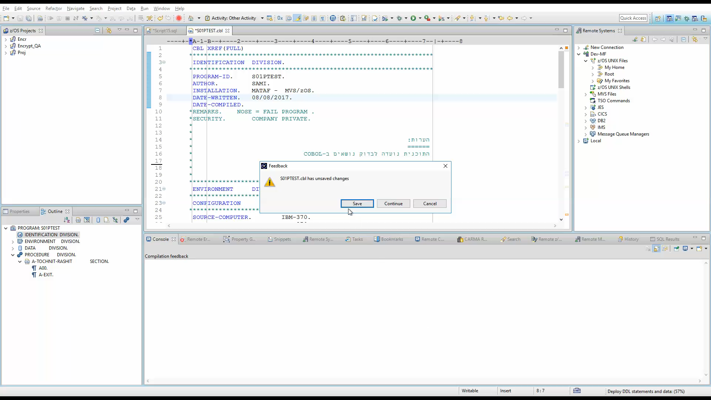
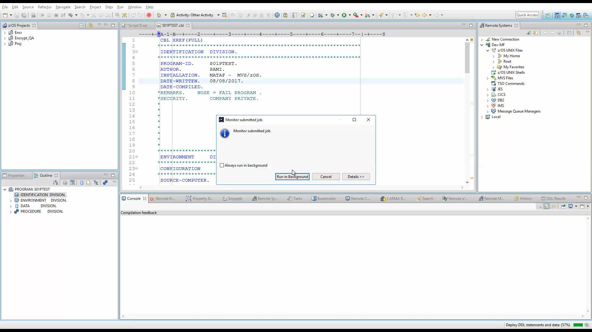
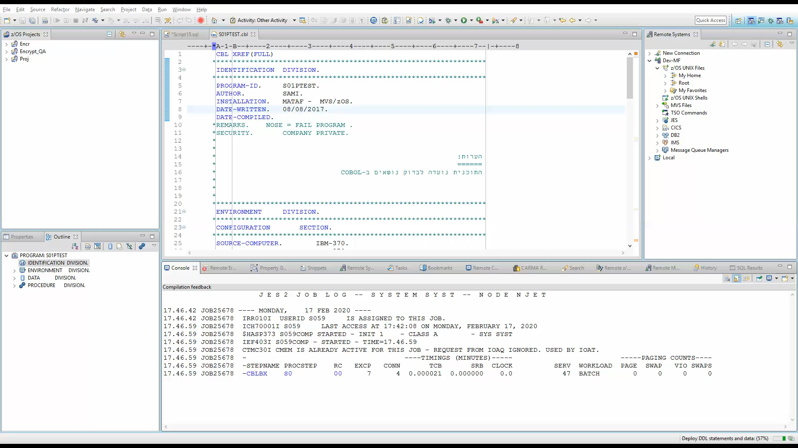
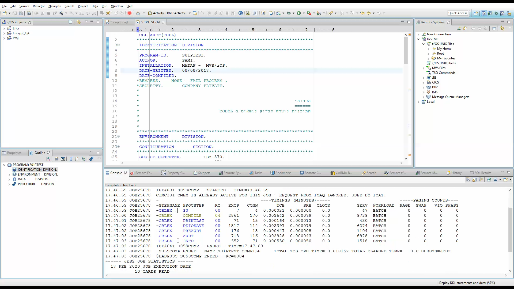
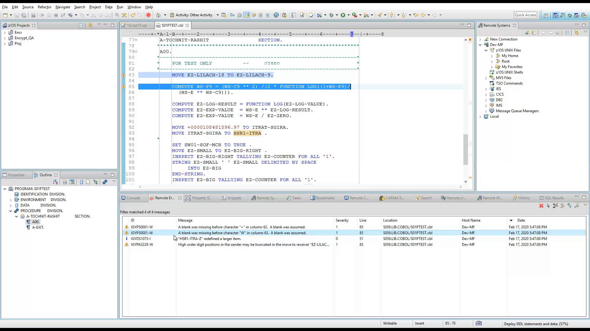

# Demo breakdown
## The feedback context 

## Checking for unsaved changes

## A job is submitted on the mainframe

## The console view shows updates from JESMSGLG

## The console is still accessible after job completion
### Steps and return codes are highlighted and color-coded

## IBM's Remote Error List is populated with compilation messages
### The messages appear on the source code and you can jump directly to them
